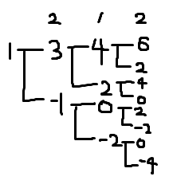
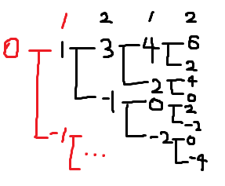
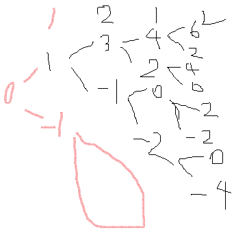

# [DFS/BFS][Lv2] 타겟 넘버 - 자바스크립트 js

## 프로그래머스 문제

[https://programmers.co.kr/learn/courses/30/lessons/43165](https://programmers.co.kr/learn/courses/30/lessons/43165#)

## 시도 1.

일단 전체 탐색을 해야 하니 `dfs` 로 풀어야 한다고 생각했는데 감이 잘 안잡혀서 좀 멍때렸다.

`[1, 2, 1, 2]` 로 탐색 할 경우, 다음과 같은 그래프를 가진다.. 

다음 인덱스의 값을 덧셈/뺄셈한 값을 방문하는 것이다.



다음 그림을 토대로 재귀함수 `next` 를 만들었다.

```tsx
0. 끝까지 모두 탐색했는지 먼저 검사한다. -> target과 비교후 answer++;

그렇지 않다면..
1. 다음 인덱스와 그 값을 구한다.
2. 다음 인덱스 값+토탈값(acc)으로 next를 호출한다.
3. 다음 인덱스 값-토탈값(acc)으로 next를 호출한다.
```

```jsx
function solution(numbers, target) {
    let answer = 0;
    let numbersLen = numbers.length;

    function next(idx, acc){
        if(idx === numbersLen-1){
            // 최종 값이 target과 같은지 비교
            if(acc === target) answer++;
        } else {
            let nextIdx = idx+1;
            let now = numbers[nextIdx];    
            next(nextIdx, acc+now);
            next(nextIdx, acc-now);
        }
    }
    
    next(0,numbers[0]);
    
    return answer;
}
```

## 시도2. 처음 값도 재귀를 돌려야한다

시도1의 코드를 실행했더니 내가 추가로 넣은 테스트 케이스 중 하나가 틀렸다.

왜그런가 했더니 아까 그림에서 첫번째 요소는 너무 자연스럽게 + 한 값으로 시작했던 것...

다음 그림에서 빨간색으로 되어있는 부분을 실행하지 않고 있었던 것.



그래서 수정했다.

```tsx
function solution(numbers, target) {
    let answer = 0;
    let numbersLen = numbers.length;

    function next(idx, acc){
        if(idx === numbersLen-1){
            // 최종 값이 target과 같은지 비교
            if(acc === target) answer++;
        } else {
            let nextIdx = idx+1;
            let now = numbers[nextIdx];    
            next(nextIdx, acc+now);
            next(nextIdx, acc-now);
        }
    }
    
    next(-1,0); // numbers의 처음 값도 next로 재귀를 돌 수 있도록 수정!
    
    return answer;
}
```

```tsx
채점을 시작합니다.
정확성  테스트
테스트 1 〉	통과 (12.93ms, 32.1MB)
테스트 2 〉	통과 (12.51ms, 31.6MB)
테스트 3 〉	통과 (0.19ms, 30.2MB)
테스트 4 〉	통과 (0.85ms, 29.8MB)
테스트 5 〉	통과 (2.97ms, 31.9MB)
테스트 6 〉	통과 (0.55ms, 29.7MB)
테스트 7 〉	통과 (0.30ms, 30.1MB)
테스트 8 〉	통과 (2.29ms, 31.8MB)
채점 결과
정확성: 100.0
합계: 100.0 / 100.0
```

끝! 

- 처음 할 때 그림판으로 생각해보며 썼던 메모.. 이걸로 포스팅 하기엔.. 너무 날로 먹는 것 같아서 나름 열심히.. 다시 썼다.🥰

    