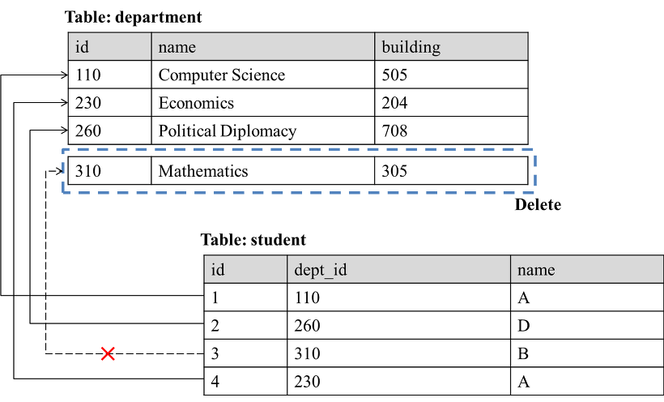
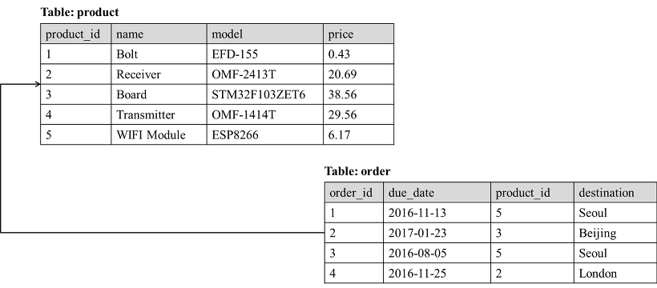

# RDBS - 무결성 (Integrity)과 키

학부생, 자격증 시험볼때 무작정 외웠던 것들을 되돌아보기

## ⚡ 데이터의 무결성이란

데이터의 `정확성` `일관성` `유효성` 이 유지되는 것을 말한다.

데이터의 무결성을 유지하는 것은 DBMS의 중요한 기능이며, 데이터에 적용되는 연산에 제한을 두어 데이터의 무결성을 유지한다.

## 1. 개체 무결성 (Entity integrity)

모든 테이블이 기본키(pk)로 선택된 필드를 가져야 한다. 기본 키로 선택된 필드는 고유한 값을 가져야 하며, 빈 값은 허용하지 않는다.

## 2. 참조 무결성 (Referential integrity)

참조 관계에 있는 두 테이블의 데이터가 항상 일관된 값을 갖도록 유지되는 것.

다음 그림은 참조 무결성이 깨지는 경우를 보여준다.

`department` 테이블의 id=310인 레코드를 삭제 시, `student` 테이블에서 id=3 레코드는 dept_id가 삭제된 310을 참조하고 있었기 때문에 존재하지 않는 데이터를 참조하게 된다.

## 3. 도메인 무결성 (Domain integrity)

테이블에 존재하는 필드의 무결성을 보장하기 위한 것.

필드의 타입, NULL값의 허용 등에 대한 사항을 정의하고 올바른 데이터가 입력됐는지 확인하는 것.

(ex) 도메인 무결성이 깨지는 경우 : 주민등록번호 필드에 알파벳이 입력되는 경우

DBMS의 기본값 설정, NOT NULL 옵션 등의 제약 사항으로 도메인 무결성을 보장할 수 있다.

## 4. 무결성 규칙 (Integrity rule)

데이터의 무결성을 지키기 위한 모든 제약사항들을 말한다.

비즈니스 규칙은 DB 이용 유저에 따라 서로 다르게 적용되지만, 무결성 규칙은 DB전체에 공통적으로 적용되는 규칙이다.

## 🔑 키의 종류와 기능

다양한 종류의 키들은 db에서 데이터의 무결성을 유지하기 위한 중요한 수단으로 이용되고 있다.

- 유일성 : 모든 레코드에서 해당 필드에 중복된 값이 나타나지 않는 속성.
- 최소성 : 최소한의 필드로 레코드를 유일하게 구별할 수 있는 속성.

## 1. 슈퍼 키 (Super Key)

슈퍼키는 테이블에 존재하는 필드들의 부분집합이며 `유일성`을 만족해야 한다.

슈퍼 키 중에서 `최소성` 을 만족하는 키 = 후보키

## 2. 후보 키 (Candidate key)

기본 키가 될 수 있는 키.

테이블에 존재하는 전체 필드의 부분집합으로, `유일성`과 `최소성`을 만족해야한다.

- 후보키 탈락 예시
    - { id, dept_id } ⇒ 최소성 만족 x (id만으로 레코드 구별 가능)
    - { dept_id } ⇒ 유일성 만족x

## 3. 기본 키 (Primary key)

테이블에서 특정 레코드를 구별하기 위해 후보 키 중에서 선택 된 고유한 식별자.

`유일성` `최소성` `NULL 값 불가` 만족해야 한다.

- 기본키 선택 시 고려할 사항
    - **값이 자주 변경되지 않는 것 선택** : 값이 변경될 때 마다 해당 값이 유일한지, NULL 값은 아닌지 검사해야하기 때문에 자주 변경되지 않는 필드를 기본키로 설정하는 것이 좋다.
    - **값이 단순한 것을 선택 :** 많은 자릿수를 갖거나 많은 문자를 포함한다면 기본 키 비교시 그만큼 많은 비용이 소모될 것이므로 짧고 단순한 형식의 데이터를 저장하는 필드를 설정하자!

## 4. 대체 키 (Alternate key)

후보키 중에서 기본키로 선택된 것들을 제외한 모든 키

## 5. 복합 키 (Composite key)

한개 이상의 필드를 포함하는 키.

## 6. 외래 키 (Foreign key)

한 테이블의 키 중에서 다른 테이블의 레코드를 유일하게 식별할 수 있는 키.

한 테이블의 레코드에서 다른 테이블의 레코드를 참조하기 위해 이용된다.

아래 이미지에서 `order` 테이블의 `product_id` 는 `product` 테이블의 `product_id` 를 통해 해당 레코드를 참조하기 위해 설정 된 외래키이다.

외래키는 다음과 같은 속성(제약 조건)을 통해 참조 무결성과 관련된 문제가 발생하지 않도록 한다.

- **속성**
    1. 하나의 필드 또는 전체 필드의 부분집합으로 구성된다.
    2. 중복된 값과 NULL 값을 가질 수 `있다`
    3. 반드시 `참조되는 테이블에서 유일한 값을 갖는 필드` 를 참조해야 한다.(EX) 참조할 테이블의 기본키
    4. 참조할 테이블에 존재하는 값 만을 가져야 한다. NULL값은 실제로 존재하는 값은 아니지만, 많은 DB에서 NULL값은 예외로 한다.

## 외래 키와 참조 무결성

DB에서 참조 무결성을 위해 참조 대상이 존재하지 않는 외래 키를 허용하지 않는다.

어떤 외래키 `B` 가 `A`를 참조한다면, `A` 는 반드시 db에 존재해야 한다. 

외래키는 참조 무결성을 지키기 위해 `RESTRICTED` `CASCADE` `SET NULL` 이라는 개념을 외래 키에 적용할 수 있도록 기능을 제공한다.

+ `RESTRICTED`  : 레코드를 변경/삭제 시, 해당 레코드를 참조하고 있는 개체가 있다면 변경/삭제 **연산을 취소**
+ `CASCADE` : 레코드를 변경/삭제 시, 해당 레코드를 **참조하고 있는 개체도 변경/삭제**
+ `SET NULL` : 레코드 변경/삭제 시, 해당 레코드를 **참조하고 있는 개체의 값을 NULL로 설정**

### 참고
---

[https://untitledtblog.tistory.com/123](https://untitledtblog.tistory.com/123)