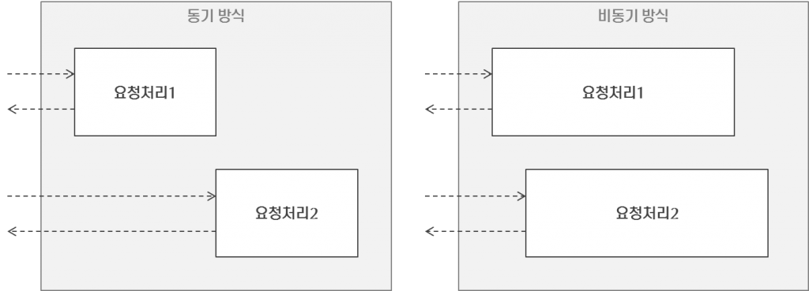

# 비동기 처리 이해 * 프로세스와 스레드

## ⛅ 프로세스

운영체제로부터 자원을 할당 받는 작업의 단위   
어플리케이션 하나가 프로세스, 그 안에서 분기 처리가 스레드.

### 멀티 프로세스

하나의 **프로그램을 여러개의 프로세스로 구성**, 각 프로세스가 하나의 작업을 처리하는 것.

* 장점 : 하나의 프로세스가 잘못되어도 프로그램은 동작함.
* 단점 : 💡**context switching** 비용 발생.

> **💡 context switching**

cpu에서 여러 프로세스를 돌아가며 작업을 처리하는 과정.

* 다음의 과정을 말한다.   
⇒ 멀티프로세스환경에서 cpu가 어떤 하나의 프로세스를 실행하고 있다.    
⇒ 이때 인터럽트 요청에 의해 다음 우선순위의 프로세스가 실행되어야 한다.   
⇒ 기존 실행중이던 프로세스의 상태를 저장한다.   
⇒ 그리고 cpu가 다음 프로세스를 수행하도록 세로운 프로세스의 상태를 교체한다.      

* 동작중인 프로세스가 자신의 상태(context)를 보관하며 대기하고 있다가 다시 실행시 복구하는 비용(시간)을 말한다.

## ⛅ 스레드

할당 받은 자원을 이용하는 실행의 단위   
프로세스 내 여러개 존재 가능

### 멀티 스레드

하나의 프로그램을 **여러개의 스레드로 구성**하고 각 스레드가 작업을 처리하는 것.

프로세스와 다르게 스레드간 자원을 공유하고 있다는 사실을 명심한다.

* 장점 : 시스템 자원 소모 감소, 처리 비용 감소(실행 속도 향상), 스레드간 자원 공유(stack영역)
* 단점 : 디버깅 어려움, 동기화 이슈 발생, 하나의 스레드의 오류→ 전체 프로세스에 문제 발생

> **💡 Thread Safe**

여러 스레드가 동시에 사용되어도 안전하다는 것을 의미.

특정 함수 a와 변수 b가 여러 스레드에서 호출되어도 하나의 스레드에서 호출했을 때와 같은 결과가 보장되어야 한다는 의미.

함수가 전역변수를 참조하게 된다면 그 함수는 thread safe하지 않은 결과가 나올 수도 있다.

## ⛅ 비동기 처리

### 등장 배경

대부분의 기업형 애플리케이션은 중앙 서버에서 동작하며, 서버는 **중앙집중형태**로 클라이언트의 요청을 받는다. ⇒ **병목현상** 발생 가능성 높음

대부분의 병목 구간은 **입출력(IO)에서 발생**하며**,** 이러한 문제를 해결하기 위해 **사용자의 요청을 스레드로 처리**한다.

### 멀티 스레드의 한계

멀티 스레드 기반 서버는 일반적으로 **클라이언트의 요청마다 스레드를 발생**시킨다.

⇒ 동접자수가 많을 수록 스레드가 많이 발생함 
⇒ 메모리 자원 소모 多 but 서버 자원은 한정되어있음 
⇒ 일정 수 이상의 스레드는 발생시킬 수 없음!!

이러한 근본적인 문제를 안고 있기 때문에 서버를 업그레이드하거나 로드밸런싱등으로 **분산처리**를 한다.

결론적으로 멀티 스레드는 개발자입장에선 직관적이지만, 네트워크에서 동시에 대규모 요청을 처리하는 데는 부적절하다. 이 부분을 극복하기 위해선 비동기 프로그래밍을 사용해야 한다.

### 병렬처리의 대안 : 비동기 처리

**동기방식**은 하나의 요청이 처리되는 동안 다른 요청이 처리되지 못한다. 따라서 요청이 완료되어야 다음 요청으로 넘어갈 수 있다. 동기방식은 IO처리를 💡Blocking하는데 지금까지는 이 문제를 스레드로 처리했다.

비동기방식은 하나의 요청 처리가 완료되기전에 제어권을 다음 요청으로 넘긴다. 따라서 IO처리인 경우 Blocking되지 않으며 다음 요청을 처리할 수 있는 것 이다.

> 💡 **Blocking I/O**

웹 앱이 브라우저에서 특정 코드를 실행하느라 브라우저에게 제어권을 돌려주지 않으면 브라우저는 마치 정지된 것처럼 보일 수 있습니다. 이러한 현상을 blocking 이라고 부릅니다. **[출처](https://developer.mozilla.org/ko/docs/Learn/JavaScript/Asynchronous/Concepts)**

하나의 프로세스가 어떤 자원을 사용하고자 할 때 그 자원을 다른 프로세스가 점유하고 있다면, 그 프로세스가 그 자원의 사용을 끝마칠 때까지 기다려야 한다는 것.

## ⛅ 자바스크립트는 싱글 스레드 기반이다.

**싱글 스레드** 기반이며 **이벤트 기반의 비동기 방식**으로 요청을 처리한다. 

따라서 요청을 처리하며 다음 요청을 받을 수 있다. 응답을 기다리지 않고 바로 다음 작업을 실행한다는 것이다. 또한 병렬처리를 스레드로 처리하지 않고 **이벤트 기반 비동기로 처리**하므로 멀티스레드가 갖는 근본적인 문제에서 자유롭다.

*+Node.js ⇒ 싱글 쓰레드만 사용하는 것이 아니라 내부적으로 멀티 쓰레드 풀을 사용하기는 한다.*

### 참고
---
[https://www.nextree.co.kr/p7292/](https://www.nextree.co.kr/p7292/)   
[https://edu.goorm.io/learn/lecture/557/한-눈에-끝내는-node-js/lesson/21763/이벤트-기반-비동기-방식](https://edu.goorm.io/learn/lecture/557/%ED%95%9C-%EB%88%88%EC%97%90-%EB%81%9D%EB%82%B4%EB%8A%94-node-js/lesson/21763/%EC%9D%B4%EB%B2%A4%ED%8A%B8-%EA%B8%B0%EB%B0%98-%EB%B9%84%EB%8F%99%EA%B8%B0-%EB%B0%A9%EC%8B%9D)