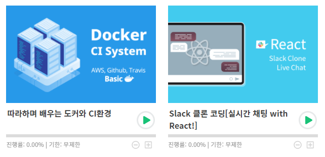

# 𝑴𝑰𝑳 ²⁰²¹ ⁰⁶

# 𝑴𝒐𝒏𝒕𝒉𝒍𝒚 𝑰 𝑳𝒆𝒂𝒓𝒏𝒆𝒅

### _²⁰²¹ ⁰⁶ 🇲 🇪 🇲 🇴 🇮 🇷 🇸_   
### - 𝐾𝑖𝑚 𝐸𝑢𝑛 𝐽𝑖

## _Monthly I Learned_ 🍎

> **💕 Total : 12건**

|Date|Category|Title|
|---|---|---|
|21.06.02|DB|[RDBS - 무결성 (Integrity)과 키](https://kim-eun-ji.github.io/TIL/DB/rdbs-Integrity-key.html)|
|21.06.10|DB|[[MYSQL] DATE_FORMAT](https://kim-eun-ji.github.io/TIL/DB/mysql-DATE_FORMAT.html)|
|21.06.14|Algorithm|[[해시][Lv1] 완주하지 못한 선수 - 자바스크립트](https://kim-eun-ji.github.io/TIL/Algorithm/hash-lv1-42576.html)|
|21.06.14|Algorithm|[[해시][Lv2] 위장 - 자바스크립트](https://kim-eun-ji.github.io/TIL/Algorithm/hash-lv2-42578.html)|
|21.06.14|Algorithm|[[해시][Lv3] 베스트앨범 - 자바스크립트](https://kim-eun-ji.github.io/TIL/Algorithm/hash-lv3-42579.html)|
|21.06.16|Algorithm|[[스택/큐][Lv2] 기능개발 - 자바스크립트](https://kim-eun-ji.github.io/TIL/Algorithm/sq-lv2-42586.html)|
|21.06.17|Algorithm|[[스택/큐][Lv2] 프린터 - 자바스크립트](https://kim-eun-ji.github.io/TIL/Algorithm/sq-lv2-42587.html)|
|21.06.18|Algorithm|[[스택/큐][lv3] 다리를 지나는 트럭 - 자바스크립트](https://kim-eun-ji.github.io/TIL/Algorithm/sq-lv3-42583.html)|
|21.06.21|Algorithm|[[힙][Lv3] 디스크 컨트롤러 - 자바스크립트](https://kim-eun-ji.github.io/TIL/Algorithm/heap-lv3-42627.html)|
|21.06.23|Algorithm|[[힙][Lv3] 이중우선순위큐 - 자바스크립트](https://kim-eun-ji.github.io/TIL/Algorithm/heap-lv3-42628.html)|
|21.06.25|Algorithm|[[완전탐색][Lv2] - 소수찾기 자바스크립트](https://kim-eun-ji.github.io/TIL/Algorithm/fs-lv2-42839.html)|
|21.06.28|Algorithm|[[완전탐색][Lv2] - 카펫 자바스크립트](https://kim-eun-ji.github.io/TIL/Algorithm/fs-lv2-42842.html)|

## 정리 🍋

### 플러그인 장착 🍋
vuepress 블로그에 ga도 달고, 구글 검색 엔진에 등록했다!    
비록 ctr은 낮지만 내 글이 구글에 노출되는 것 자체가 재밌음~~   
또한 `back-to-top` , `last-updated` 플러그인도 추가해주었다.   
다음달엔 댓글도 추가할 예정!

### 알고리즘 🍋
이번 달엔 주로 프로그래머스 코딩테스트 연습 게시글을 많이 올렸다.   
코딩테스트 준비 목적이라기보단, 나름 학부생시절엔 알고리즘 과목을 A+도 받았었고 C++이나 C, JAVA등으로 다양한 자료구조를 설계하고 코딩할 수 있었는데
복습을 하지 않아 모두 잊어버렸다..ㅠㅠ   
꾸준한 반복과 복습을 위해 틈틈이 연습할 예정!
   
### 다음 달 목표 🍋
인프런에서 강의를 구매했다!   
   
사이드 프로젝트 진행하며 이것까지 공부하기에 벅찰 수도 있지만..
일단 결제해두면 돈이 아까워서라도 보겠지?의 생각으로 그냥 재밌어 보이는 강의를 구매했다.   
   
다음달에 진행률 각각 20퍼센트 이상씩 찍혀있는 것이 목표다! 화이팅~~